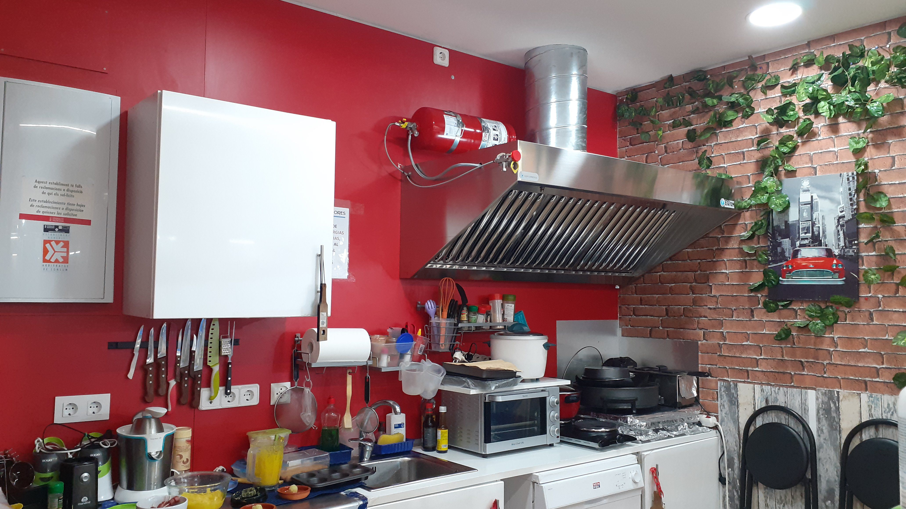
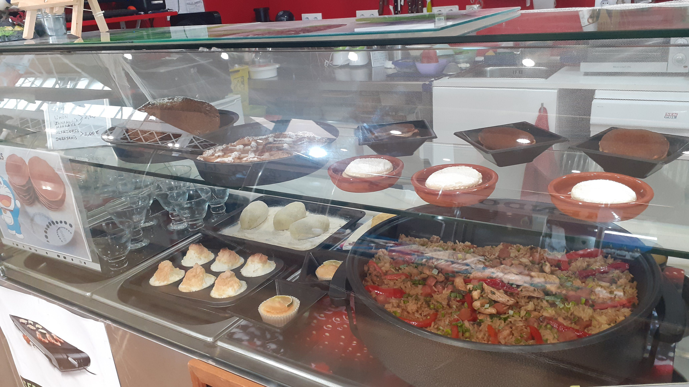
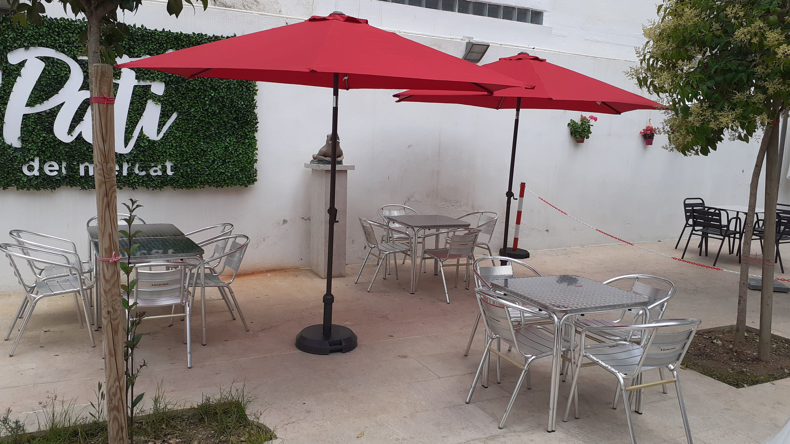

Se encontraba en el Mercado Municipal de Vinaròs, y se trataba de comida y servicios varios para llevar o para consumir en las instalaciones del propio Mercado.

Contaba con terraza exterior. Se encuentraba equipado con mobiliario y maquinaria.

Se trataba de un negocio rentable y ventajoso, con bastante afluencia de clientela debido a la diversidad de negocios existentes en el propio Mercado.

El local era adecuado para todo tipo de negocios, como por ejemplo, pizzería, pastelería, crepería, hamburguesería, venta de kebab, bocadillos, hot dogs, ensaladas, zumos, comida oriental, comida latina, etc.

Tel. / WhatsApp 651 94 55 87

<html>
<head>
	
</head>
<body>

</body>
</html>